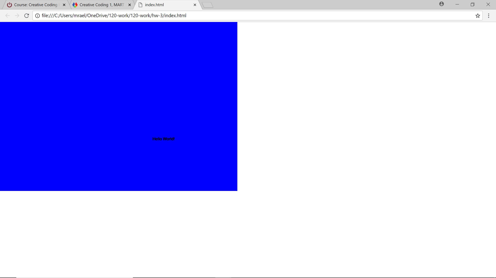

Morgan Long, 51

["Hello World!" Sketch](https://morganlong26.github.io/120-work/hw-3/)
# Homework 3 Response
For this assignment I followed all of the video examples offered on the class website. I find this the easiest way to complete the homework assignments because you have a visual tutorial along with text, so you have both ways to get help and answers. Typically when I do these assignments it takes me a few hours because I go through and watch the videos and follow along with them at the same time. I find this very beneficial and in doing this I really never run into any issues or questions.

- First I log on to our course website and go through all the videos and follow them at the same time as watching them.
- Then I will read the text part and go to some of the extra links provided.
- Next I start the homework, and I follow along with the homework videos.
- Finally I will submit my final to GitHub and the course moodle page.

## Problems
I personally didn't have many issues or questions. I find that if you follow the videos you're pretty well set. The only issue I had was trying to add a block comment. For some reason when I was trying to add one it would turn everything grey even the code. The symbols were just positioned incorrectly, so it was an easy fixed once figured out. I didn't post about the issue on the class repo because I thought it was probably a simple fix. As for my fellow classmates at the time of me completing this assignment other peoples questions were answered.

### New Knowledge
I learned so much! I have never done anything with code before so all of this information is new. Everything was explained very clearly whether it was through the videos or text.

#### Picture of Final Product

