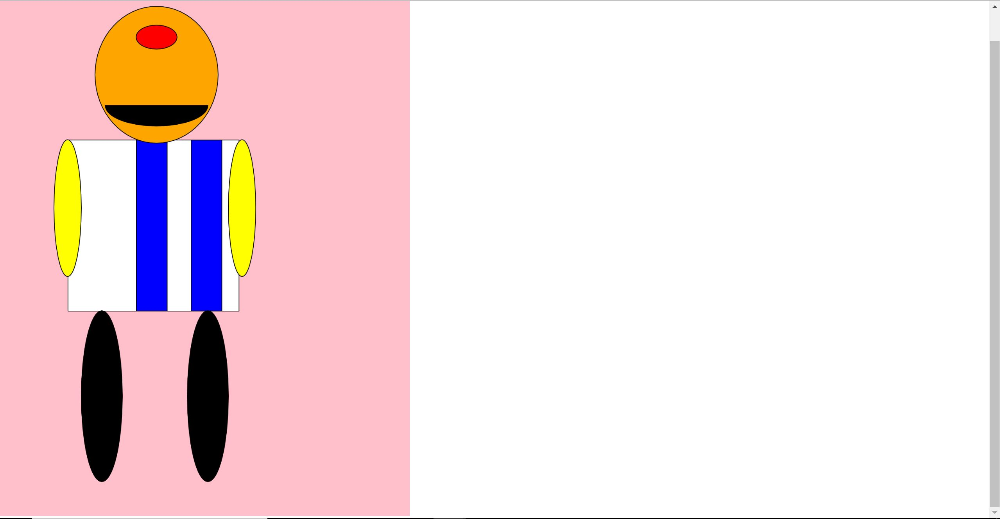

# Homework 4
Morgan Long

## Assignment Review
This assignment was challenging, but a lot of fun. It took some time to get use to. Especially when it came to the grid and having to figure out what numbers to use. For this project I chose to make a monster. More specifically a cyclops. The shapes I mostly used were rectangles and circles. I gave my cyclops a striped shirt and played around with the colors.

### Steps Taken
- First I went to the course website and went through all of the tabs and interactive tools.
- Then I watched the example that the professor gave.
- After watching the example video I began my assignment.
- It was fairly straight forward from there. I did have to go back and get examples and references quite a bit.

#### Issues
I did have issues with what numbers to use for the grid. I just went to all of the text examples and video examples and that help a great deal. I'm still struggling with the grid and numbers, but I'm not as confused as I was when I first started this project. As for helping fellow classmates, many of them are forming study groups, so there wasn't any questions posted.

##### Picture of my monster

